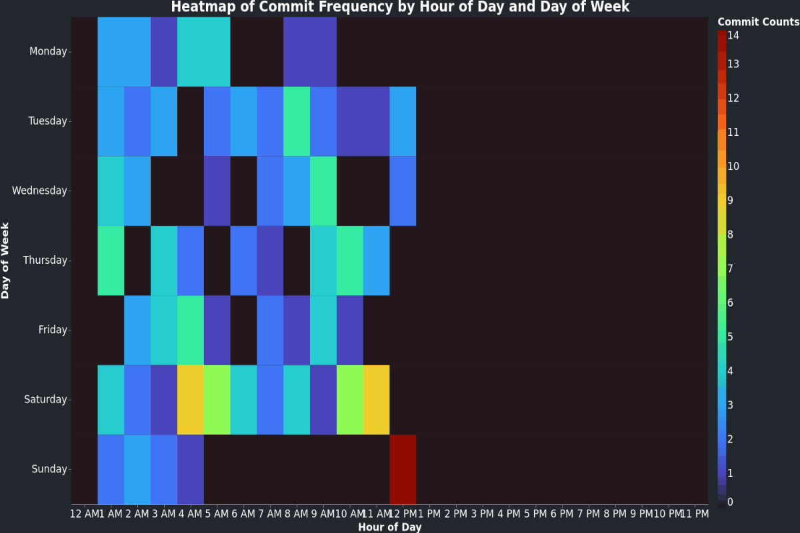

## Hi there 👋

<!--
**renerod1/renerod1** is a ✨ _special_ ✨ repository because its `README.md` (this file) appears on your GitHub profile.

Here are some ideas to get you started:

- 🔭 I’m currently working on ...
- 🌱 I’m currently learning ...
- 👯 I’m looking to collaborate on ...
- 🤔 I’m looking for help with ...
- 💬 Ask me about ...
- 📫 How to reach me: ...
- 😄 Pronouns: ...
- ⚡ Fun fact: ...
-->

# 📊 GitHub Stats:

 

## 🏆 GitHub Trophies

---

### Data last generated on: 2024-10-09 via [GitHub Action 11248567245](https://github.com/renerod1/renerod1/actions/runs/11248567245)

## 🚀 Recent Commits

- **midjourney-image-previewer - [Merge pull request #12 from renerod1/11-submit-button-does-not-work-on-first-click  fix(midjourney): fixed onClick of the Submit button](https://github.com/renerod1/midjourney-image-previewer/commit/1b397ec0f7d64533b39d72865479d6416f648383)**
  - Additions: 3 - Deletions: 1 - Total Changes: 4

- **midjourney-image-previewer - [fix(midjourney): fixed onClick of the Submit button not properly firing on the first click](https://github.com/renerod1/midjourney-image-previewer/commit/046bd4ddd6910e2690965a88ae996e9504f2eddf)**
  - Additions: 3 - Deletions: 1 - Total Changes: 4

- **midjourney-image-previewer - [docs(readme.md): finally updated the README](https://github.com/renerod1/midjourney-image-previewer/commit/79776303b76ad7c8015cd8f1eec3eef1d0af48c7)**
  - Additions: 39 - Deletions: 9 - Total Changes: 48

## 🔀 Recently Merged Pull Requests

